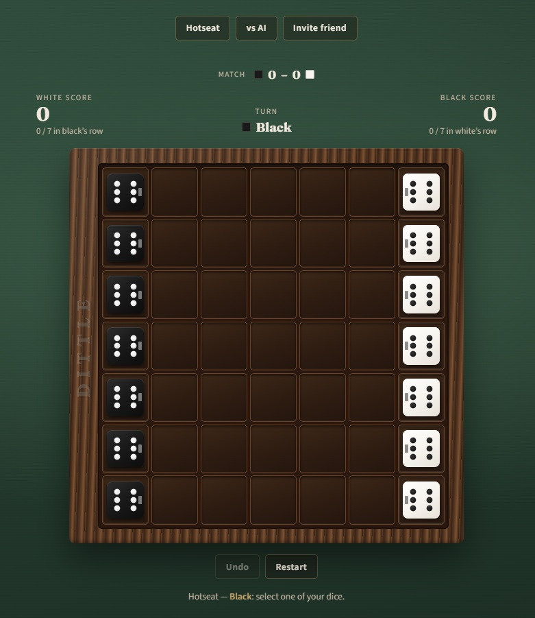

# Dittle

A browser port of **Dittle – Dice Battle**: a two-player strategy game where you tilt and jump dice across a wooden 7×7 board. Getting all seven of your dice into the opponent’s base ends the game — but the **higher face-up sum** wins, so speed alone is not enough.

<!-- Replace screenshot.png with a real capture of the board in play. -->

## Play

| Mode | How |
|------|-----|
| **Hotseat** | Both colors on one device |
| **vs AI** | You are Black; a very stupid heuristic AI plays White |
| **Invite friend** | Host copies a `?join=` link; guest opens it. Host = Black, guest = White |

Match wins (Black – White) accumulate across **Play again / Restart** in the same session. Switching mode or creating a new invite resets the tally.

Online notes: keep the host tab open until the guest joins. 

## Rules

- Setup: seven black dice (left) and seven white (right), **6** up, **4** toward the opponent.
- One move per turn: **tilt** (changes the top face), **jump**, or **tilt then jump** (including multi-jumps / L-shapes).
- No backward movement, no diagonals, no spinning in place.
- Game ends when one player has all seven dice in the opponent’s base column.
- Winner = higher sum of face-up values among dice in the opponent’s base (ties possible).

Ghost dice on legal squares preview the top face after that move.

## Tech

- Pure front end: `index.html` (CSS + engine + UI)
- Online: PeerJS DataChannel, host-authoritative moves
- No backend required for GitHub Pages

## Future ideas

- **Dittle Clash** variant (tilts only, clash/elimination, first die across wins)
- Stronger AI / difficulty levels
- Spectator peers

